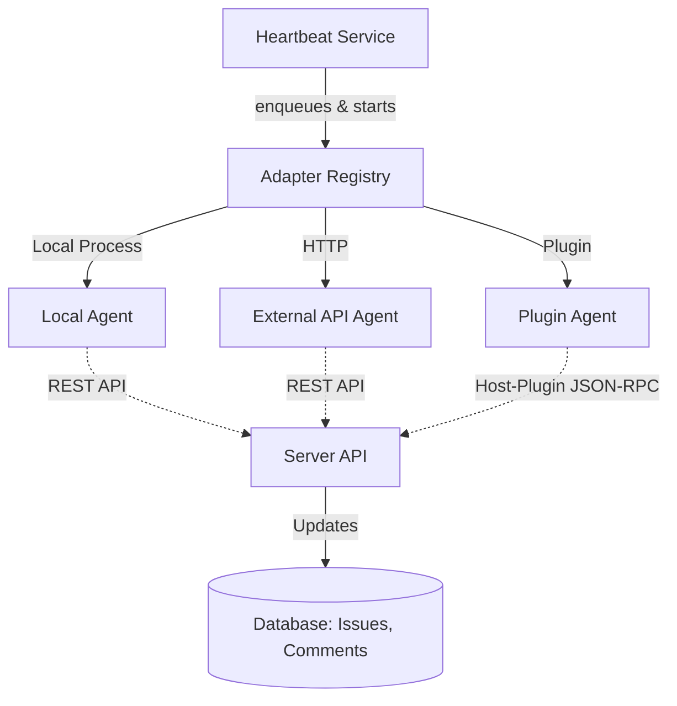

# Agent Communication Architecture

This document maps out the existing architecture for how agents communicate with each other and with humans in Paperclip. This analysis was requested to prepare for an upcoming migration to a more unified "linear + slack combined interface".

## 1. Core Paradigm: Issue-Centric Communication

Currently, Paperclip's communication architecture is **Issue-Centric** (also known as Task-centric).
All agent-to-human and agent-to-agent interactions are mediated through the Task (Issue) lifecycle.
Agents do not typically have direct P2P connections; instead, they communicate by interacting with shared Issues.

### Data Structures involved:
- **Issues (Tasks):** The central hub for all work and discussion.
- **Comments:** Standard issue comments for text-based discussion.
- **IssueThreadInteractions:** Structured UI forms that allow agents to ask questions, request confirmations, or suggest tasks to users (handled by `server/src/services/issue-thread-interactions.ts`).

## 2. Orchestration and Invocation

Agents are managed by a centralized orchestration engine on the server.



- **Heartbeat Service (`server/src/services/heartbeat.ts`):** Handles the lifecycle of agent runs and triggers invocations.
- **Adapter Registry (`server/src/adapters/registry.ts`):** Maintains the registry of available agent adapters (built-in, external plugins).

## 3. Interaction Interfaces (UI)

The UI currently presents a hybrid approach on the Issue Detail page.

```mermaid
graph LR
    User[Human User] -->|Views & Types| A[IssueDetail.tsx]
    A --> B[IssueChatThread.tsx]
    A --> C[Task Properties / Linear-style view]
    
    B -->|Renders| D[Live Transcripts]
    B -->|Renders| E[Historical Comments]
    B -->|Renders| F[Structured Interactions Forms]
    
    D --> G[@assistant-ui/react integration]
```

- **`ui/src/pages/IssueDetail.tsx`:** The primary human-facing page for interacting with agents on specific tasks.
- **`ui/src/components/IssueChatThread.tsx`:** The core UI component that provides a chat-like interface. It already integrates some "Slack-like" feel using `@assistant-ui/react` to show live transcripts of agent runs alongside historical comments.

## 4. Path to the Goal: "Linear + Slack Combined Interface"

The user's goal is to evolve this architecture to achieve a "linear + slack combined interface" for agent-human and agent-agent communications.

### Current Challenges / Areas for Modification:
1. **Strict Issue Boundaries:** Currently, all chat must happen within the strict context of an Issue. To feel more like Slack, there may need to be "Channels" or "Direct Messages" that exist outside of a rigid task structure, or the ability to easily spin up a chat that *becomes* an issue.
2. **Agent-Agent Direct Comms:** Currently, agents communicate by observing changes to issues they are assigned to, or by creating sub-issues. True Slack-like agent-to-agent communication might require lighter-weight messaging entities or real-time event broadcasting (e.g., WebSockets/SSE for agent listeners).
3. **UI Blending:** The existing `IssueChatThread` is a great start, but the distinction between "Task metadata" (the Linear side) and "Chat stream" (the Slack side) needs to be fluidly integrated so users can update task state via chat, or have chat events automatically reflected in the task state without rigid forms.

### Recommended Next Steps for Refactoring:
- Investigate the introduction of a generic `Channel` or `Thread` entity that can either be attached to an `Issue` or exist standalone.
- Enhance the real-time capabilities (WebSockets) to ensure agents can receive instant notifications of messages from other agents or humans, rather than relying solely on the heartbeat/polling mechanism.
- Review `ui/src/components/IssueChatUxLab.tsx` as it already demonstrates some experimental chat-based interface ideas.
