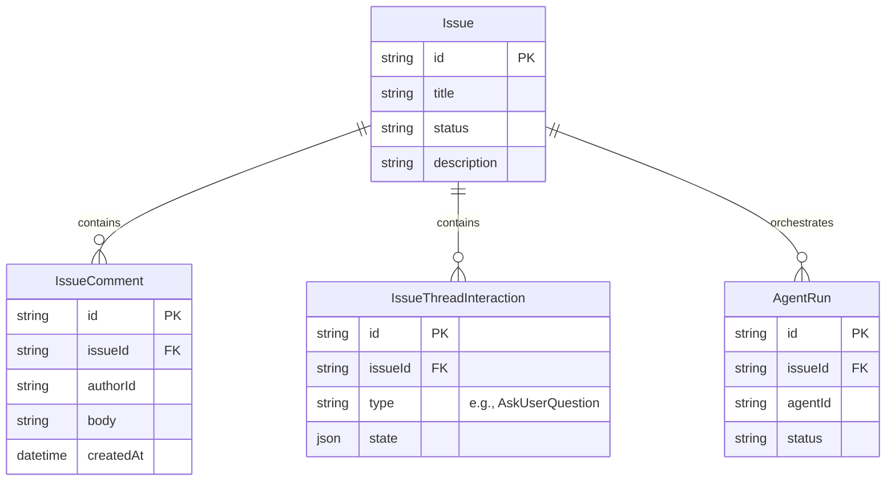
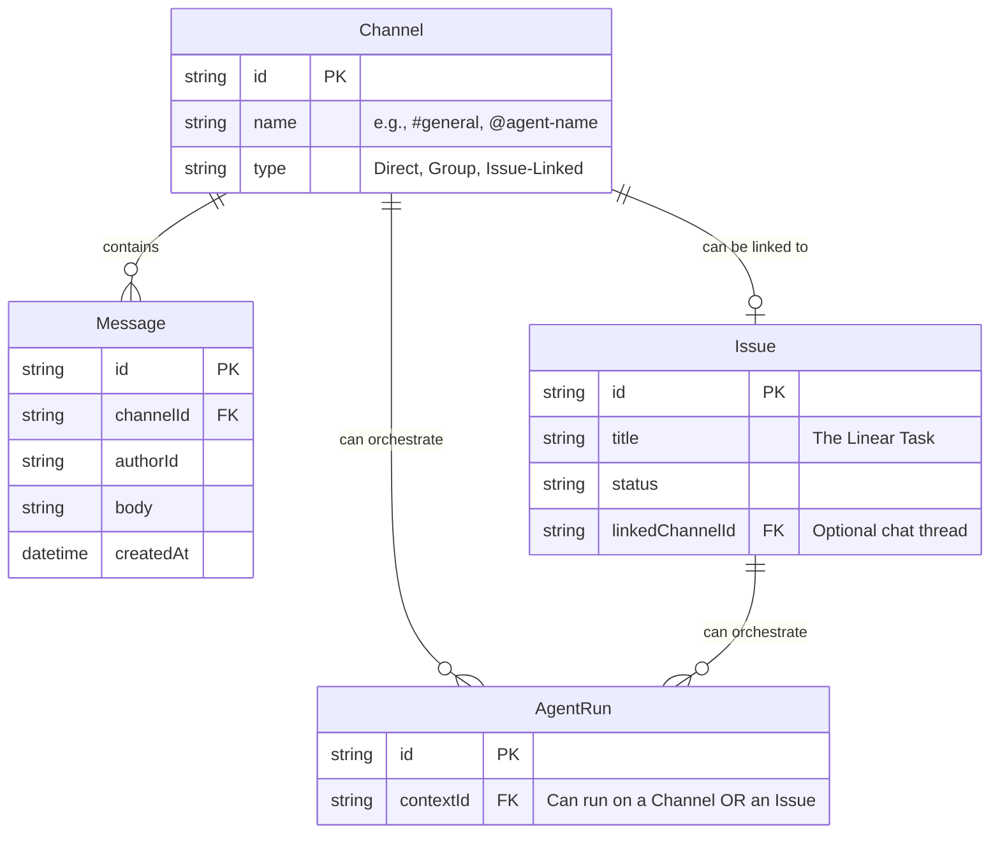
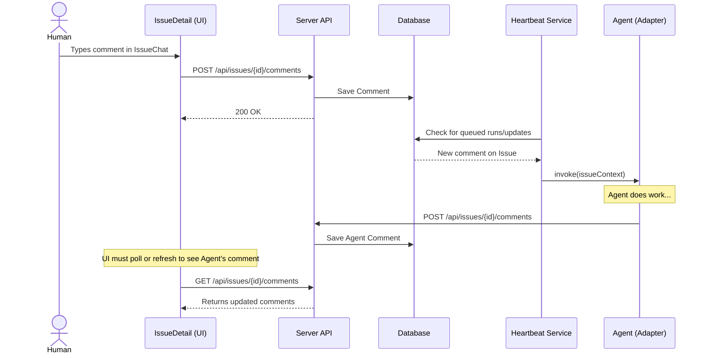
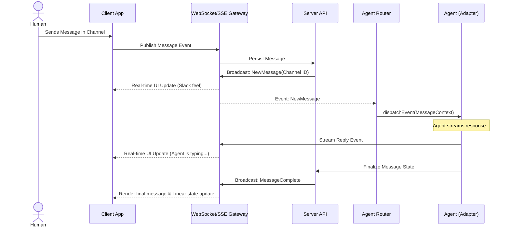
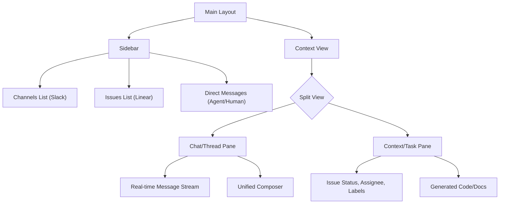

# Visual Architecture: Paperclip Agent Communications

This document contains detailed visualizations of the current and proposed Paperclip communication architectures, designed to support the migration towards a "Linear + Slack combined interface".

---

## 1. Current State: Issue-Centric Data Model

Currently, all communication is strictly bound to an `Issue` (Task). There is no concept of a standalone chat.

---

## 2. Proposed State: Channel & Issue (Slack + Linear) Data Model

To achieve a combined interface, communication (Chat/Channels) must be decoupled from Tasks (Issues), while allowing them to reference each other fluidly.

---

## 3. Current State: Communication Sequence (Polling / REST)

Agents currently communicate by polling for work and posting updates back to the REST API.

---

## 4. Proposed State: Communication Sequence (Real-time / WebSocket)

To achieve a "Slack-like" feel, real-time bidirectional communication is required for both humans and agents.

---

## 5. Proposed UI Architecture (The "Combined" Interface)

A high-level component tree for the target user interface.

